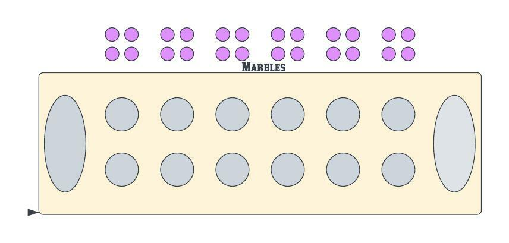
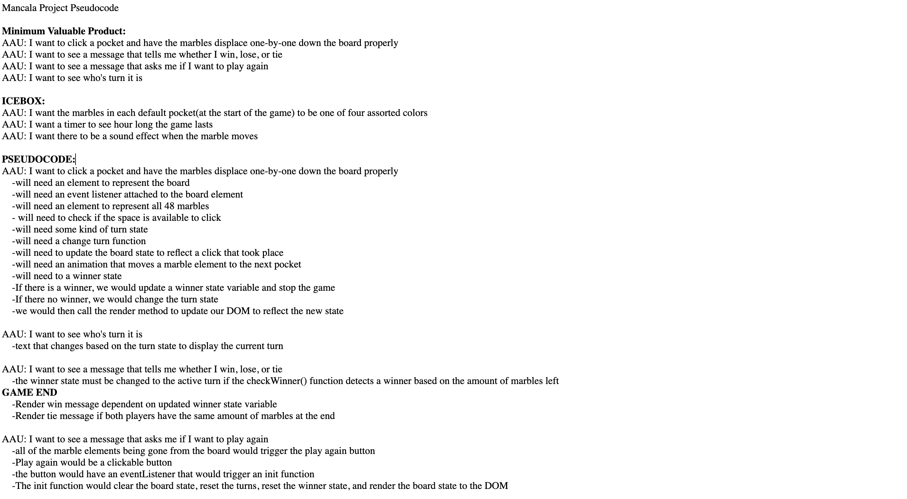

# Isaiah_Vogt_SD_Repo
Mancala- "The mancala games are a family of two-player turn-based strategy board games played with small stones, beans, or seeds and rows of holes or pits in the earth, a board or other playing surface. The objective is usually to capture all or some set of the opponent's pieces(Wikipedia)"

BrowserGame: https://ivogt12.github.io/Isaiah_Vogt_SD_Repo/

☐ Technologies Used: JavaScript, HTML, CSS

☐ Icebox: 
    1)I want the marbles in each default pocket(at the start of the game) to be one of four assorted colors
    2)I want a timer to see hour long the game lasts
    3)I want there to be a sound effect when the marble moves

☐ Commits:
    -"Initial commit"(initialized files)

    -"work"(first lines of html and css)

    -"layout"(initial finalization of board)

    -"12/31"(finalization of board design)

    -"1/1"(initial construction of JavaScript)

    -"1/4"(added series of if statements and initial design for class structure)

    -"1/6"(redesigned structure of JavaScript/removed classes)

    -"namechange"(changed name of js directory)

Resources:
https://dev.to/turneremma21/circular-access-of-array-in-javascript-j52
